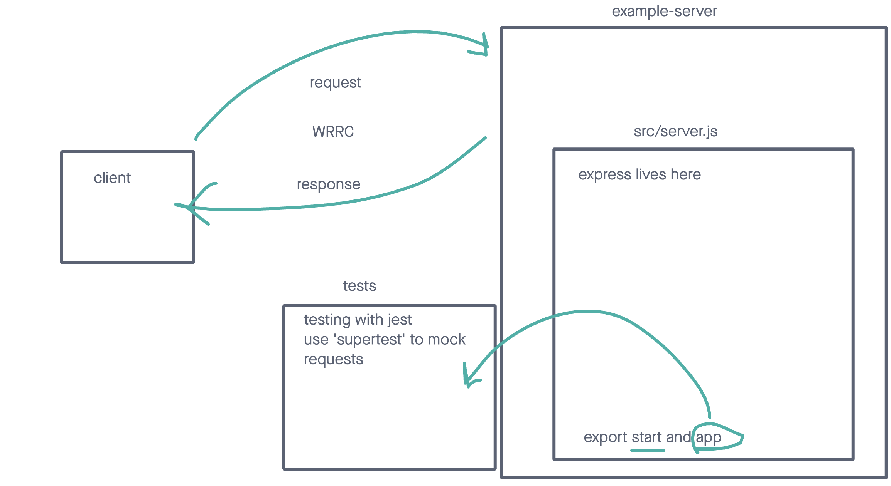

# LAB - Class 01

## Project: server-deployment-practice

### Author: Kao Saelor

### Problem Domain

This very basic express server is used as a base for CI/CD deployment exercises

### Links and Resources

- [GitHub Actions ci/cd](https://github.com/CodingKao/server-deployment-practice/actions)
- [back-end dev server url](https://server-deployment-practice-h4hx.onrender.com/)
- [back-end prod server url](https://main-4pfp.onrender.com/)

### Collaborators

- Repo forked from Ryan C.
- Collaborated with Kenya W. and Corianna W.

### Setup

#### `.env` requirements (where applicable)

port variable exists within the env sample

#### How to initialize/run your application (where applicable)

clone repo, `npm i`, then run `nodemon` in the terminal

#### Routes

- GET : `/success` - specific route to hit

#### Tests

to run tests, after running `npm i`, run the command `npm test`

#### UML

